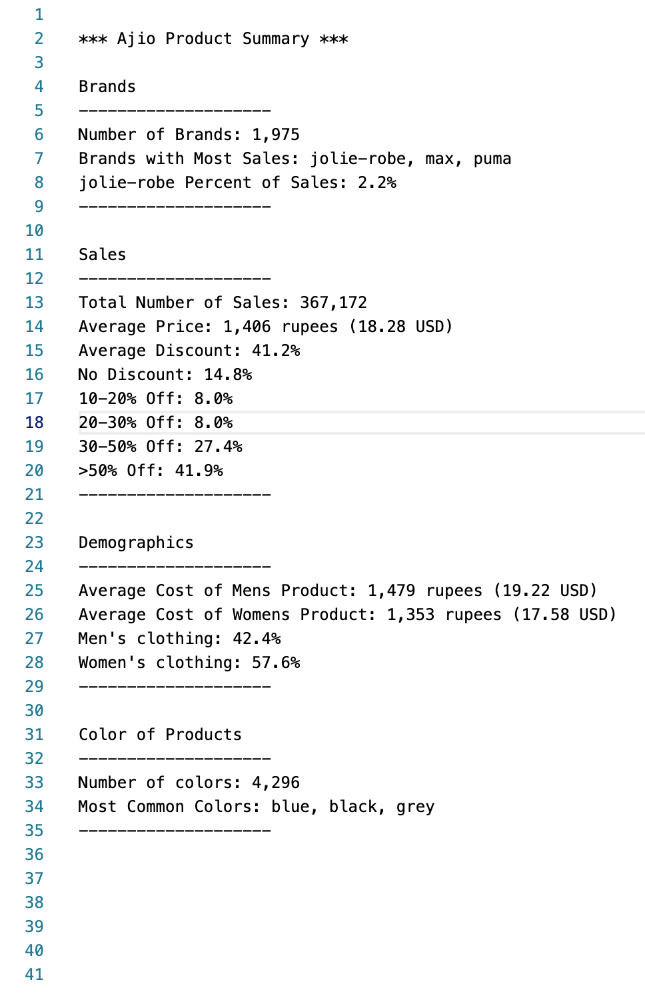

# Ajio-Products-Analysis

## Overview

This script uses Python to determine important product information from Ajio clothing sales. Founded in 2016, Ajio is an Indian eCommerce company that sells clothing online for men, women and children. Earlier this year (2022), Kaggle uploaded a csv file containing a list of sales the company made, along with various information about the sale. The data file can be found . 

This project aimed to answer the following questions:

* What are the most common brands sold?
* Were male or female clothing more expensive?
* What was the average discount on a given sale?
* What additional information can be gleaned from this dataset?

## Results

The answers to the posed questions were written to a . The following is a screenshot of the file: 

As can be seen in the image above:

* The brand Jolie-robe showed the most orders
* A majority of the orders had a discount of 30% or higher
* On average, female clothing was less expensive by roughly 100 rupees (1.30 USD)
* The order were almost evenly divided between mens and women's clothing
* there was a surprising 4,296 different colors of clothing sold

## Limitations of Dataset

Unfortunately, Kaggle does not provide any contextual information for this dataset. As a result, it is difficult to know when these sales were made, or what the orders all have in common. For example, were these orders the online sales made for 2021? Or were they recent sales made in the last quarter? With more context, stronger conclusions could be made from the data. More information could also be gleaned by comparing these sales to those of other companies. Are other companies selling clothing with an average discount of 41%, for example? 

Nonetheless, one of the strongest conclusions that was made from this analysis is the diversity in brands and color schema for the clothing that Ajio sold.
